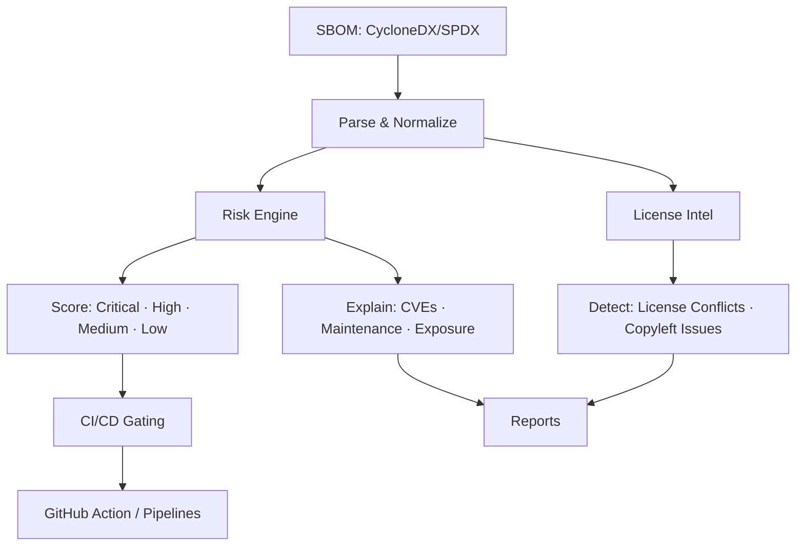

<!-- PROFILE HEADER -->
<div align="center">
  

  🃏 Crypto 🃏
  **SecOps builder · SBOM intelligence · Low-level, failure-obsessed**

  <p align="center">
    <a href="https://github.com/MellyFinnese">
      
    </a>
    <a href="https://github.com/MellyFinnese?tab=repositories">
      
    </a>
    
    
  </p>
</div>

---

## ⚡ Snapshot x Signal

    </tr>
    <td valign="top" width="55%">

### Current Pulse
- 🎯 **Current focus:** `AI-BOM Inspector` – AI-powered SBOM risk & license scanner
- 🔎 **Drawn to:** firmware, reverse engineering, weird edge cases, failure paths
- 🧠 **Style:** think like the attacker, build like the defender
- 📡 **Open to:** collabs on security tooling, SBOM workflows, CI/CD security

> I’ve seen the wrong side of security. Now I use that perspective to build tools that keep the blast radius small.

    </td>
    <td valign="top" width="45%">

### Quick Signal
<p align="center">
  
  <br/>
  
</p>

    </td>
    </tr>
  </table>

---

## 🧨 Flagship – AI-BOM Inspector

> From raw SBOMs to **clear risk intel**: vulnerable dependencies, license traps, and what to fix first.

<div align="center">

| 🔍 AI-BOM Inspector | Details |
|---------------------|---------|
| 🧾 **Input** | CycloneDX / SPDX SBOMs |
| 🧠 **Output** | AI-ranked risk, reasoning, and prioritized recommendations (WIP) |
| 🛡 **Use Case** | Supply-chain security, SecOps, CI/CD gating |
| 🧩 **Roadmap** | GitHub Action · CI/CD blocking · dashboard |
| 📂 **Repo** | 👉 <a href="https://github.com/MellyFinnese/AI-BOM-Inspector">AI-BOM-Inspector</a> |

</div>

```bash
# Run a scan
ai-bom-inspector \
  --sbom path/to/sbom.json \
  --format cyclonedx \
  --verbose
```

### 🗂 Project Shelf (pin these on the profile)
- 🧪 **AI-BOM Inspector** – AI x SBOM risk analysis & license inspection
- 🛰 **Low-level / firmware lab** – system internals, boot/OS experiments, failure hunting
- ⚙️ **Clean utility** – smaller but fully documented tool with tests (discipline over hype)
- 🧱 **Security toolkit skeleton** – reusable template for future tools

### 🗺 AI-BOM Inspector – Flow from Code to Clarity


- Granular risk scoring (CVSS, maintenance, license risk, popularity, ecosystem health)
- Explain every flag (CVE, abandonware, license conflict)
- Remediation ideas and safer alternatives (where it matters)
- GitHub Action to post risk intel directly on pull requests
- CI/CD mode to block builds above a configurable risk threshold
- Lightweight dashboard / TUI for dependency health over time

---

## 🧰 Skill Matrix
<div align="center">
  
</div>

<details>
<summary><b>🧪 Languages</b></summary>

- Python – security tooling, CLIs, end-to-end workflows
- Rust – performance and safety when I need both
- C – where abstractions drop and the real behavior shows

</details>
<details>
<summary><b>🛡 Security / Domain</b></summary>

- SBOMs (CycloneDX / SPDX) and supply-chain analysis
- Dependency intelligence: risk, licenses, maintenance, ecosystem signals
- CI/CD security hooks, GitHub Actions, risk-based gating
- Applying an attacker mindset to build stronger defenses

</details>
<details>
<summary><b>⚙️ Ecosystem</b></summary>

- Linux as the main lab
- Docker for reproducible environments
- GitHub Actions for continuous checks & automation
- Issues / Discussions as live feedback loops

</details>

---

## 🧠 Philosophy – Edge, Not Villain
- I don’t sanitize the story; I choose where the line is **now**.
- I care about how systems really fail, not just how they’re supposed to work.
- Curiosity fuels tools that **reduce** blast radius.
- I’d rather ship one tool that actually protects people than a dozen forgettable scripts.
- Antihero energy: aware of the dark, committed to pointing it in the right direction.

---

## 📈 Recently Shipped
- ✅ Initial release of **AI-BOM Inspector** CLI
- ✅ SBOM parsing + base risk highlighting
- ✅ First external review integrated into roadmap (scoring, explainability, integrations)
- 🔜 GitHub Action: auto-comment risk insights on PRs
- 🔜 CI/CD risk threshold mode: fail builds when the dependency tree gets sketchy

---

## 🛰 Ops Log
<details open>
<summary><b>Timeline</b></summary>

- 2025-11 – AI-BOM Inspector tested by external users; workflow + feature ideas captured
- 2025-11 – GitHub profile refocused around AI x security, supply-chain defense, low-level work
- 2025-11 – Roadmap shaped: granular risk, explanations, remediation, GH Action, CI/CD
- 2025-12+ – Focus: integrations, more real SBOMs, polished UX for teams

</details>

---

## 📊 GitHub Pulse
<div align="center">
  
  <br/><br/>
  
</div>

---

## 🧾 Project Hygiene Checklist
For repos you actually want security engineers, dev leads, and teams to trust:
- LICENSE – clear, explicit (MIT / Apache-2.0 / etc.)
- SECURITY.md – how to report issues responsibly
- CONTRIBUTING.md – how to open issues / PRs without wasting time
- CODE_OF_CONDUCT.md – standard, but shows you’re running a serious project
- GitHub Actions workflow (tests / lint) + CI badge in README

---

## 🤝 Collaborate
If you’re working on:
- Security tooling
- SBOM workflows / supply-chain security
- AI x SecOps

…pair antihero perspective with disciplined engineering. Open an issue on one of my repos or start a discussion here:

👉 **AI-BOM Inspector Discussions**
<div align="center">

🔗 <a href="https://mellyfinnese.github.io">mellyfinnese.github.io</a> — lab / landing (WIP)
</div>
