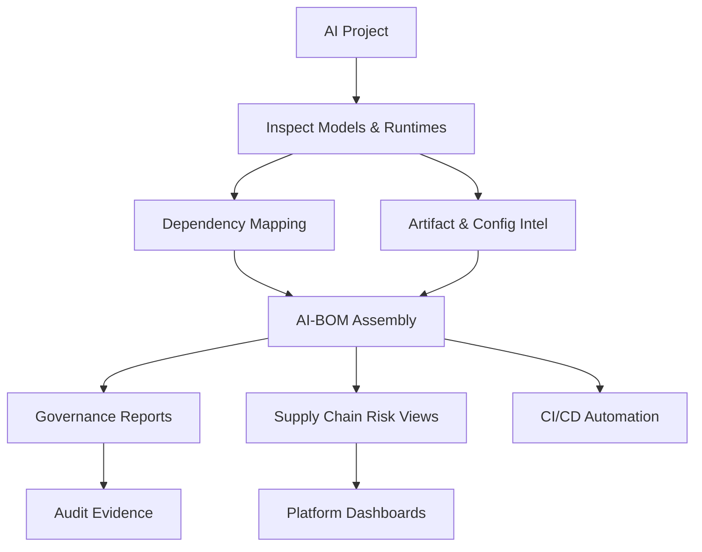

<!-- PROFILE HEADER -->

  

  

    🃏 Crypto 🃏 
    <strong>AI supply chain visibility · Governance-ready AI-BOMs · Failure-obsessed</strong>
  

  

    
    
    
    
  

  <!-- Live counters -->
  

    
    
    
  

---

## ⚡ Current Pulse
- 🎯 **Current focus:** `AI-BOM Inspector` – enterprise AI software supply chain visibility & introspection
- 🔎 **Built for:** security, compliance, and platform teams who need audit-ready AI-BOMs
- 🧠 **Style:** systems-level visibility with governance-first outputs
- 📡 **Open to:** collabs on AI-BOM tooling, supply chain visibility, CI/CD automation

> I’ve seen systems break. Now I build the tools that **keep the blast radius small**.

---

## 📡 Quick Signal

  
   
  

---

## 🧨 Flagship – AI-BOM Inspector
> From raw AI stacks to **inspectable AI-BOMs**: models, runtimes, artifacts, and relationships mapped for governance.

| 🔍 Enterprise AI-BOM Inspector | Details |
|---------------------|---------|
| 🧾 **Input** | AI project repos, model assets, runtime configs |
| 🧠 **Output** | Structured AI-BOMs, dependency maps, governance-ready intel |
| 🛡 **Use Case** | AI supply chain security, audit readiness, architecture review |
| 🧩 **Roadmap** | CI/CD automation · policy integration · dashboards · audit export |
| 📂 **Repo** | 👉 <a href="https://github.com/MellyFinnese/AI-BOM-Inspector">AI-BOM-Inspector</a> |

---

## ✨ Feature Flash

  
  
  
  
  
  

---

## 🛰 Live Workflow Dashboard

  

### 🗺 Enterprise AI-BOM Inspector – Flow from Code to Clarity

```mermaid
graph TD;
    A[AI Project] --> B[Inspect Models & Runtimes];
    B --> C[Dependency Mapping];
    B --> D[Artifact & Config Intel];
    C --> E[AI-BOM Assembly];
    D --> E;
    E --> F[Governance Reports];
    E --> G[Supply Chain Risk Views];
    F --> H[Audit Evidence];
    G --> I[Platform Dashboards];
    E --> J[CI/CD Automation];
```

**What the engine ships:**
- Model, framework, and runtime introspection with AI-specific artifacts
- Structured AI-BOM outputs for governance and reporting
- Dependency & artifact mapping across AI stacks
- Security and risk visibility for supply chain reviews
- Automation-ready outputs for CI/CD and programmatic pipelines
- Audit evidence exports for compliance reviews
- Dashboard-ready visibility for platform-wide AI workloads

---

## 🧩 Core Capabilities

| Capability | Impact |
|-----------|--------|
| 🧠 **AI System Introspection** | Identify models, frameworks, runtimes, and configs |
| 🧱 **Dependency & Artifact Mapping** | Normalize direct/transitive relationships |
| 🧾 **AI-BOM Generation** | Governance-ready outputs for audits and reporting |
| 🛡 **Security & Risk Visibility** | Surface exposure and architectural risk |
| 🤖 **Automation & Integration** | CI/CD-ready outputs and programmatic access |

---

## 🧭 Enterprise Use Cases

| Use Case | Outcome |
|----------|---------|
| 🏛 **AI Governance & Regulatory Readiness** | Evidence-ready AI-BOMs for audits |
| 🧪 **Security Architecture Review** | Visibility into models, runtimes, and artifacts |
| 🧨 **Supply Chain Risk Management** | Identify hidden dependencies and exposure |
| 🧷 **Compliance Evidence Generation** | Structured outputs for internal controls |
| 🛰 **Platform Engineering Visibility** | Fleet-level views across AI workloads |

---

## 🧪 Program Spotlight

| Focus | Mission |
|------|---------|
| 🚀 **AI-BOM Inspector** | AI supply chain visibility & AI-BOM governance |
| 🧱 **Automation Blueprints** | CI/CD-ready inspection pipelines for AI stacks |
| 🧭 **Introspection Research** | Relationship mapping across AI artifacts |

---

## 🧰 Skill Matrix

  

---

## 🎆 Design Philosophy
- Systems-level visibility beats shallow scans
- Map relationships, not just components
- Governance-ready outputs make AI deployment safer
- Built for teams who need evidence, not vibes

---

## 📈 Recently Shipped
- ✅ AI-BOM Inspector core engine
- ✅ AI system introspection + AI-BOM generation
- ✅ Dependency & artifact mapping across AI stacks
- 🔜 CI/CD automation for inspection pipelines
- 🔜 Audit evidence exports + dashboard rollups

---

## 📊 GitHub Pulse

  
    
  

