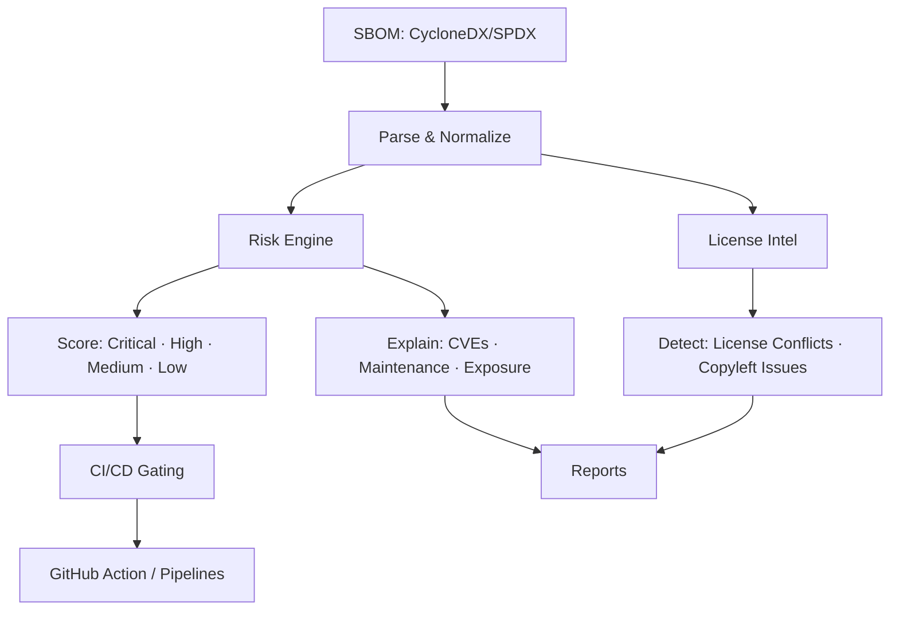

<!-- PROFILE HEADER -->

  

  

    🃏 Crypto 🃏 
    <strong>SecOps builder · SBOM intelligence · Low-level, failure-obsessed</strong>
  

  

    
    
    
    
  

  <!-- Live counters -->
  

    
    
    
  

---

## ⚡ Current Pulse
- 🎯 **Current focus:** `AI-BOM Inspector` – AI-powered SBOM risk & license scanner
- 🔎 **Drawn to:** firmware, reverse engineering, edge-case chaos, failure hunting
- 🧠 **Style:** think like the attacker, build like the defender
- 📡 **Open to:** collabs on security tooling, SBOM workflows, CI/CD security

> I’ve seen systems break. Now I build the tools that **keep the blast radius small**.

---

## 📡 Quick Signal

  
   
  

---

## 🧨 Flagship – AI-BOM Inspector
> From raw SBOMs to **clear risk intel**: vulnerable dependencies, license traps, and prioritized fixes.

| 🔍 AI-BOM Inspector | Details |
|---------------------|---------|
| 🧾 **Input** | CycloneDX / SPDX SBOMs |
| 🧠 **Output** | AI-ranked risk, reasoning, prioritized recommendations |
| 🛡 **Use Case** | Supply-chain security, SecOps, CI/CD gating |
| 🧩 **Roadmap** | GitHub Action · CI/CD blocking · dashboard |
| 📂 **Repo** | 👉 <a href="https://github.com/MellyFinnese/AI-BOM-Inspector">AI-BOM-Inspector</a> |

---

## 🛰 Live Workflow Dashboard

  

### 🗺 AI-BOM Inspector – Flow from Code to Clarity

```mermaid
graph TD;
    A[SBOM: CycloneDX/SPDX] --> B[Parse & Normalize];
    B --> C[Risk Engine];
    B --> D[License Intel];
    C --> E[Score: Critical · High · Medium · Low];
    C --> F[Explain: CVEs · Maintenance · Exposure];
    D --> G[Detect: License Conflicts · Copyleft Issues];
    E --> H[CI/CD Gating];
    F --> I[Reports];
    G --> I;
    H --> J[GitHub Action / Pipelines];
```

**What the engine ships:**
- Granular scoring (CVSS, maintenance, license risk, popularity, ecosystem health)
- Explain every flag (CVE, abandonware, license conflict)
- Remediation ideas & safer alternatives
- GitHub Action posts risk intel directly on PRs
- CI/CD mode blocks builds above configurable risk thresholds
- Lightweight dashboard / TUI tracks dependency health over time

---

## 🧰 Skill Matrix

  

---

## 🎆 Philosophy & Legacy Vibe
- I don’t sanitize the story; I choose the line of defense
- Curiosity fuels tools that reduce real-world blast radius
- I ship one tool that matters, not dozens of forgettable scripts
- Aware of the dark, committed to pointing it right

---

## 📈 Recently Shipped
- ✅ Initial release of AI-BOM Inspector CLI
- ✅ SBOM parsing + base risk highlighting
- ✅ External review integrated: scoring, explainability, roadmap
- 🔜 GitHub Action: auto-comment risk insights on PRs
- 🔜 CI/CD risk threshold mode: fail risky builds

---

## 📊 GitHub Pulse

  
    
  

