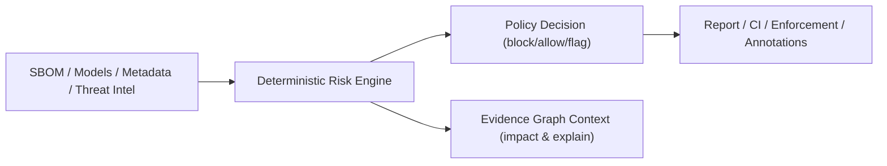

<!-- NEON AI-BOM HEADER -->
<div align="center">
  <pre style="font-family:monospace;line-height:0.85"> 
   █████╗ ██╗ ██████╗     ██████╗  ____   ____  __  __  
  ██╔══██╗██║██╔════╝    ██╔═══██╗|  _ \ / __ \|  \/  | 
  ███████║██║██║  ███╗   ██║   ██║| |_) | |  | | \  / | 
  ██╔══██║██║██║   ██║   ██║   ██║|  _ <| |  | | |\/| | 
  ██║  ██║██║╚██████╔╝   ╚██████╔╝| |_) | |__| | |  | | 
  ╚═╝  ╚═╝╚═╝ ╚═════╝     ╚═════╝ |____/ \____/|_|  |_| 
  </pre>

  

  <p>
    <strong>Neon AI supply-chain visibility · Governance-first AI-BOMs · Audit-ready</strong>
  </p>

  <p>
    <a href="https://github.com/MellyFinnese/AI-BOM-Inspector"></a>
    
    
  </p>

</div>

---

# AI-BOM Inspector

Official repo: https://github.com/MellyFinnese/AI-BOM-Inspector

AI-BOM Inspector is an offline-first, deterministic risk engine for AI supply chains. Feed it an AI project (SBOM + model artifacts) and get a policy decision, an evidence-backed report, and CI-friendly outputs for automated enforcement.

Inspect. Explain. Prove. Ship.

---

## Killer one-command demo

Give AI-BOM Inspector an AI project's SBOM and model artifacts → it determines supply-chain risk → explains why → maps affected systems → produces evidence → enforces policy.

Run the reproducible demo included with the upstream repo:

```bash
PYTHONPATH=src bash demo/golden-vulnerable-ai/run_demo.sh
```

After the run:

```bash
jq '.applications' demo/golden-vulnerable-ai/report.json
python -c "from aibom_inspector.graph import impact; exit(impact('demo/golden-vulnerable-ai/report.json','CVE-2024-XXXX'))"
```

---

## Architecture (TL;DR)


```mermaid
graph LR
  Input["SBOM / Models / Metadata / Threat Intel"] --> Engine["Deterministic Risk Engine"]
  Engine --> Policy["Policy Decision (block/allow/flag)"]
  Engine --> Graph["Evidence Graph Context (impact & explain)"]
  Policy --> Output["Report / CI / Enforcement / Annotations"]
```

Core pieces:
- Parsers & normalizers (multi-language manifests)
- Deterministic risk engine building an evidence graph
- Policy layer producing enforcement actions
- Outputs: JSON/JSON-LD, CycloneDX, SPDX, HTML/Markdown, SARIF

---

## Quickstart

Prereqs: Python 3.10+, optional Rust toolchain for native extensions, Docker for sandboxed runtime tracing.

Clone & dev-install:

```bash
git clone https://github.com/MellyFinnese/AI-BOM-Inspector.git
cd AI-BOM-Inspector
pip install -e .[dev]
```

Run scanner (autodetect manifests):

```bash
# generate AI-BOM (JSON/JSON-LD/CycloneDX)
python -m aibom.scan --source ./path/to/project --output ai-bom.json --format jsonld
```

Offline is the default. Add `--online` plus specific flags (e.g. `--with-cves`) to enable enrichment.

---

## Highlights (why use it)

- Deterministic risk engine with explainable evidence graphs
- Standards-first exports: CycloneDX & SPDX compatibility
- Model-first awareness: treats model artifacts as first-class assets
- CI-friendly: policy exits, SARIF/annotations, and failure gating
- Offline-first and privacy-preserving by default

---

## Fancy AI-BOM fragment (example)

```json
{
  "aiBomVersion": "0.1",
  "components": [
    { "id": "model:resnet50:1.0", "type": "Model", "framework": "pytorch" },
    { "id": "runtime:python:3.10", "type": "Runtime" }
  ],
  "relationships": [
    { "from": "model:resnet50:1.0", "to": "runtime:python:3.10", "type": "runsOn" }
  ]
}
```

---

## Install & build

Editable dev install:

```bash
pip install -e .[dev]
```

Build wheel (for airgapped installs):

```bash
python -m build
```

Generate CycloneDX SBOM for the tool itself:

```bash
pip install cyclonedx-bom
cyclonedx-py -o aibom-inspector-sbom.json
```

---

## CI integration (example)

Fail the pipeline if the health score drops below a threshold:

```yaml
- name: Run AI-BOM inspection
  run: |
    python -m aibom.scan --source . --output ai-bom.json
    python -m aibom.policy --input ai-bom.json --policy policies/examples/default.yml
```

---

## Examples & demos

- `demo/golden-vulnerable-ai/` — reproducible demo and sample app→report mapping
- `examples/` — sample projects and report outputs (HTML/MD/JSON)
- `docs/` — deep dives: QUICKSTART, POLICY, SCORING, FAQ

---

## Network & privacy

- Default: `--offline` (no outbound calls). Reports annotate skipped enrichment.
- Opt-in: `--online` with flags `--with-cves`, `--model-id`, etc.
- Local-only hardening: `--local-only` or `--safe-mode` to hard-block outbound fetches.

---

## Contribute

Contributions, issues, and PRs welcome. For docs or quick UI/UX touches, open a small PR; for feature changes, include tests and an example.

---

## License

MIT — see LICENSE

---

<p align="center">Built with neon vibes by <a href="https://github.com/MellyFinnese">MellyFinnese</a> · AI supply-chain obsessed 🔍</p>
